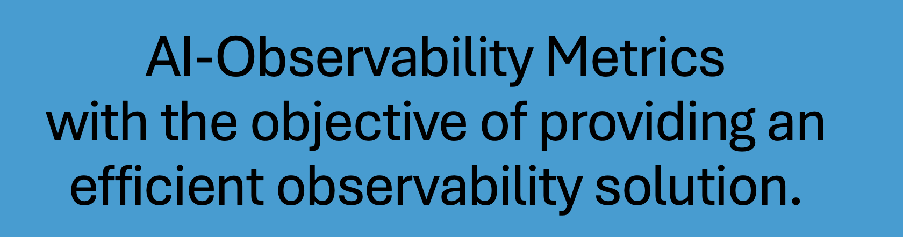
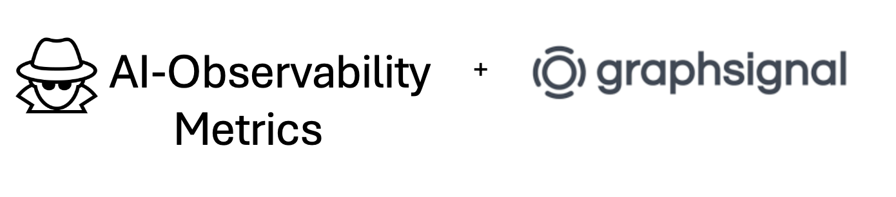

<!-- ABOUT THE PROJECT -->
## About The Project
In this project, we are building an `AI Observability Metrics extension `that leverages **Graphsignal** to collect important metrics on the application, providing key metrics through a redesigned, user-friendly web interface powered by the Carbon Design System. It features advanced filters, zooming for detailed analysis, and new metrics like GPU/CPU usage,* add more about new Metics*. These metrics can be visualized on a web browser user interface and then assessed to gain valuable insights on the execution. The seamless integration of Graphsignal with Visual Studio Code will allow developers to fine-tune their AI applications and by identifying bottlenecks- enhance their overall performance.




### Reasons to Choose AI Observability Metrics

- **Additional Metrics:** This tool adds additional metrics on top of Graphsignal's in-built metrics collection capabilities. Along with performance, metering, billing and application trace information, AI Observability Metrics also provides detailed auditing information with regards to Safety Scores, Application success and failure rates as well as detailed information on the AI models used.
- **Lightweight:** This tool is very lightweight and resource friendly solution that requires almost no setup to get started. 
- **Cost:** Many of these tools are paid solutions which require investment by the organization. For larger organizations, this would often include paid support and maintenance contracts which can be extremely costly and slow to negotiate.

### Workflow of AI Observability Metrics

AI Observability Metrics uses the Graphsignal opensource library, which has very low overhead and is optimized for enterprise software development workflows and performs well across a range of observability tasks (e.g. usage analysis, code optimization and model evaluation), making it an easy and lightweight.

The workflow diagram of AI Observability Metrics is provided below.
<p align="center">
  
</p>

<!-- GETTING STARTED -->
## Getting Started 
Following are the instructions to setting up AI Observability Metrics locally.
To get a local copy up and running follow the steps.

### Prerequisites

For using `AI Observability Metrics`, you need:
- **OS:** Mac
- **DISK SPACE:** Minimum 30GB
- **Terminal:**  Homebrew (for Mac)
- **IDE:** [Visual Studio Code](https://code.visualstudio.com/download)
- **Docker:** installed [for Mac](https://docs.docker.com/desktop/install/mac-install/)
- **Python3:** If not already installed, run `brew install python3`. After completion, run `pip3 -V`ensure successful installation.
- **Graphsignal API Key:** To get an API key, sign up for a [free account](graphsignal.com]). The key can then be found in your account's Settings / API Keys page.
- **OpenAI API Key:** To obtain an API Key, login [here](https://platform.openai.com/account/api-keys). Under "API keys", click "Create new secret key".**


### How to install AI Observability Metrics on macOS
1. Under VSCode extensions, search for `AI Observability Metrics` extension and click install. This will install all the necessary libraries and components required for execution your AI Application.Allow around 2 minutes for installation to complete.

2. If you dont see terminal output after clicking install or need to re-run installation steps, then on your keyboard, press `command ⌘` + `shift ⇧` + `P` and select ```Start AI Observability Metrics```. 

3. You should now see terminal output for the installation steps for the extension. 


### How to execute an application in MacOS:

1. Navigate to `ai_observability_metrics.py`. Define the following variables in lines 9-12.
            
```
GRAPHSIGNAL_API_KEY = "GRAPHSIGNAL_API_KEY_HERE"

OPENAI_API_KEY = "OPENAI_API_KEY_HERE"

APPLICATION_NAME = "APPLICATION_NAME_HERE"

USER_NAME = "USER_NAME_HERE"
```

Note: You can also define these variables within `ai_observability_metrics_app.py` in lines 2-5. See recording for details.

2. In `python3 ai_observability_metrics_app.py` locate the `# INSERT CODE HERE"` tag. You can start implementing your code after this line.
3. Run your code using the following command in the visual studio code command line.:
 
    `python3 ai_observability_metrics_app.py`
    

Here is a walkthrough of how to use the AI Observability Metrics tool:


 
 ### Visualization
After your application and run to completion, you can view your metrics by opening any web browser and visiting 

`localhost:3000`

### How to Contribute
Refer to this [Guildlines](https://github.com/IBM-OSS-Support/AI-Observability-Metrics/blob/main/doc/CONTRIBUTING.md) to contribute to our project.
## Next Steps 
* Enhanced integration to handle multiple users and executions simultaneously 
* Extend functionality to Windows 
